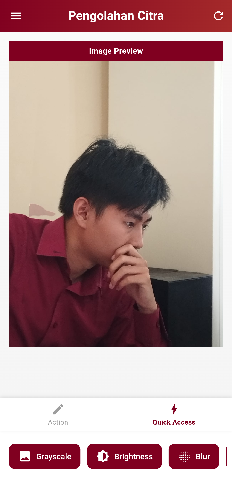

# Photo Editing App

Aplikasi editor foto sederhana untuk membantu praktikum pengolahan citra digital dalam mengimplementasikan materi-materi yang telah dipelajari.

## Demo

Berikut adalah beberapa tampilan demo dari aplikasi:

  
  
  
  
  

## Tentang Aplikasi

Photo Editing App adalah aplikasi yang dirancang untuk membantu mahasiswa dan asisten praktikum dalam mengimplementasikan konsep-konsep pengolahan citra digital yang telah dipelajari. Aplikasi ini berfungsi sebagai alat praktis untuk memahami dan mengaplikasikan materi-materi seperti:

- Pengolahan citra dasar (filtering, thresholding, dll)
- Operasi citra (flip, rotate, crop, dll)
- Penggunaan algoritma pengolahan citra (seperti grayscale, brightness, contrast, dll)
- Penggunaan demo mode untuk melihat contoh-contoh penerapan algoritma pengolahan citra

## Fitur Utama

- **Editor Foto**: Unggah foto dari galeri atau ambil foto baru menggunakan kamera
- **Filter Dasar**: Terapkan berbagai filter seperti grayscale, brightness, contrast, dll
- **Manipulasi Citra**: Lakukan operasi dasar seperti flip, rotate, crop, dll
- **Demo Mode**: Fitur yang menggabungkan semua operasi yang ada, ini merupakan versi beta nya 
- **Simpan Hasil**: Simpan hasil edit ke penyimpanan perangkat

## Cara Penggunaan

1. **Halaman Utama**: Pilih foto dari galeri atau ambil foto baru menggunakan kamera
2. **Edit Foto**: Pilih filter atau efek yang ingin diterapkan pada foto
3. **Demo**: Akses halaman demo untuk melihat contoh-contoh algoritma pengolahan citra
4. **Simpan**: Simpan hasil editan ke penyimpanan perangkat

## Persyaratan Sistem

- Perangkat dengan sistem operasi Android 5.0+
- Ruang penyimpanan yang cukup untuk menyimpan foto hasil edit
- Akses ke kamera dan galeri foto

## Kontak

Jika Anda memiliki pertanyaan atau masukan, silakan hubungi kami melalui email: [mfahdin12@gmail.com]

---

Dikembangkan sebagai bagian dari pembelajaran Praktikum Pengolahan Citra Digital 2025.
